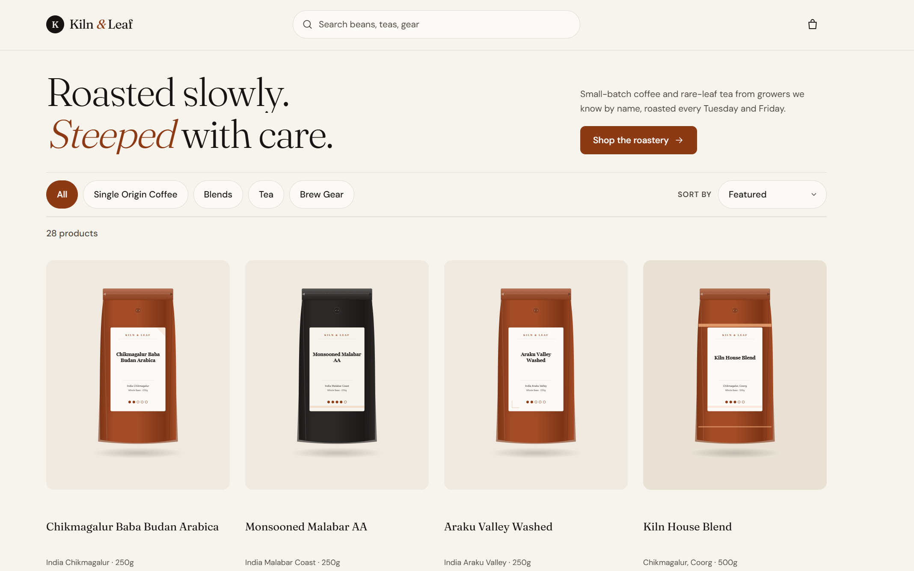
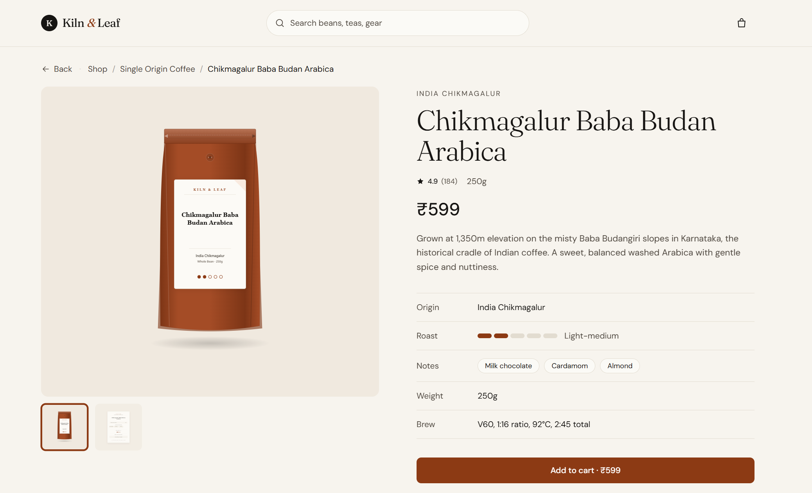
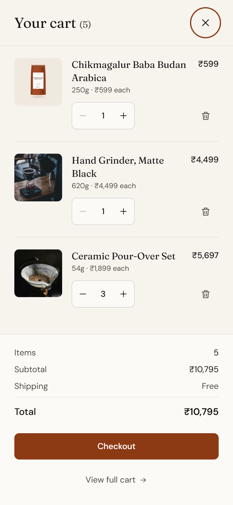

# Kiln & Leaf — Storefront

A refined artisanal e-commerce storefront for **Kiln & Leaf Roasters**, a specialty coffee roastery and rare-leaf tea blender based in Bengaluru.

Built with Vite, React 19, TypeScript (strict mode), Tailwind CSS v4, and React Router.

**Live Demo:** [https://kiln-and-leaf.vercel.app](https://kiln-and-leaf.vercel.app)

---

## Screenshots

### Desktop Experience
| Catalog & Filters | Product Detail | Slide-Over Cart Drawer |
|:---:|:---:|:---:|
|  |  |  |

### Mobile Experience
| Mobile Catalog (390px) | Mobile Cart Sheet (390px) |
|:---:|:---:|
|  |  |

---

## Features

- **Artisanal Catalog & Data Architecture**: 28 specialty coffees, Indian single-origin estate lots, rare-leaf teas, and precision brew gear sourced from local JSON (`src/data/products.json`).
- **Dynamic Packaging Art v2**: Zero third-party image dependencies for consumables; packaging SVGs are generated programmatically with large packs filling 65–70% of tile height, readable typography (12px+ titles at card size), and deterministic palette variety. Restored photo imagery for brew gear is strictly preserved.
- **CSS Subgrid Card Layout**: Cards use `grid-template-rows: subgrid` to ensure title, meta, rating/price, and action tracks align horizontally across each grid row regardless of title line count, eliminating awkward fixed-height hacks.
- **Responsive Card Interactions (Hover vs Touch)**:
  - **Hover-capable devices** (`@media (hover: hover)`): The pack image smoothly crossfades to the tasting notes illustration (`-notes.svg`) over 300ms. An inline quick-add button slides up from the bottom of the image tile on hover or keyboard focus (`:focus-within` / `:focus-visible`).
  - **Touch devices** (`hover: none`): Maintains an accessible full-width button (at least 44px tall) below the price row without hover friction.
  - **Button States**: Normal ("Add to cart"), Added confirmation ("Added ✓"), Maximum in cart ("Maximum in cart" at 20 units), and disabled Out of Stock with visible labels.
- **FLIP Grid Reorder Motion**: When changing sort criteria (same product set), cards glide smoothly from their old positions to new coordinates using the First-Last-Invert-Play (FLIP) animation pattern via `useFlipGrid`, animating `transform` only and respecting `prefers-reduced-motion`.
- **Balanced Product Detail Page**:
  - Compact single-row top navigation pairing a history-aware Back button with breadcrumb navigation.
  - Desktop two-column layout: image tile capped at `80svh` with thumbnails directly below, and a `position: sticky` buy box column that remains anchored in the viewport.
  - Category-aware reassurance badges ("Roasted to order", "Ships in 1-2 working days", "Free shipping across India").
- **Rich Editorial Content Sections**:
  1. *About this coffee / tea / piece*: Narrative story and semantic `<dl>` specifications (altitude, harvest, variety, brew recipe, etc.).
  2. *Allergen information / Materials & care*: Labelled text chips for consumables ("Contains", "May contain", or "No major allergens") and material/care specifications for brew gear.
  3. *Inside your parcel*: Detailed checklist of what arrives in the package.
  4. *Customer reviews*: Authentic verified customer reviews (2–3 per product) formatted with `Intl.DateTimeFormat('en-IN')` and accessible star ratings.
  5. *You may also like*: Same-category related product suggestions.
- **Robust Cart Management**: Slide-over drawer on desktop, bottom sheet on mobile, with line item collapse animation (`grid-template-rows: 1fr to 0fr`) and duplicate-guarded dispatch.
- **Accessibility & Contrast**: Accessible `aria-live` announcements for cart additions and line removals, focus trapping, full keyboard navigation, and WCAG AA/AAA compliant warm-contrast design tokens.
- **INR Currency System**: Realistically priced Indian rupee (₹) amounts formatted via `Intl.NumberFormat` with Indian lakh grouping, computed in integer paise (minor units) to prevent floating-point rounding errors.

> **Note on Sample Content**: Customer reviews, allergen statements, harvest specifics, and tasting narratives in this project represent curated sample content crafted for a fictional roastery store demonstration.

---

## Tech Stack

- **Core**: [React 19](https://react.dev/) + React DOM 19
- **Build & Dev Server**: [Vite 8](https://vite.dev/) with `@vitejs/plugin-react`
- **Routing**: [React Router 8](https://reactrouter.com/) (Browser router with `<ScrollRestoration />` and View Transitions)
- **Language**: TypeScript 5.7 (strict mode enabled, zero `any`, zero `@ts-ignore`)
- **Styling**: [Tailwind CSS v4](https://tailwindcss.com/) with `@tailwindcss/vite`
- **Testing**: [Vitest 5](https://vitest.dev/) (36 tests passing)
- **Tooling**: ESLint 9 (typescript-eslint, react-hooks, react-refresh) and Prettier

---

## Technical Deep Dive: Architecture & Implementation

### 1. CSS Subgrid Card Layout
Historically, card grids with varying title lengths forced developers to choose between awkward fixed heights (e.g. `height: 2.7em` on titles leaving dead whitespace for 1-line titles) or misaligned bottoms where price rows and buttons staggered unevenly across columns.

Kiln & Leaf solves this with modern **CSS Subgrid**:
- The parent container (`ProductGrid`) defines columns and auto-placed rows.
- Each `<article>` card spans rows (`row-span-4` on desktop, `row-span-5` on touch) and declares `grid-template-rows: subgrid`.
- Direct children (image tile, title `<h3>`, meta subtitle `<p>`, rating/price `<div>`, and touch action button) map 1:1 to the shared outer grid tracks.
- As a result, if any card in a row has a 2-line title, that track expands for the entire row simultaneously; 1-line titles sit comfortably within the track without dead gaps, and all subsequent rows (meta, price, and actions) align horizontally with pixel precision.

### 2. FLIP Grid Reorder (`useFlipGrid`)
When a user sorts the catalog (e.g. price low to high), standard DOM re-ordering produces an abrupt visual teleport.
Kiln & Leaf uses the **FLIP** (First, Last, Invert, Play) technique:
1. **First**: Before the new DOM layout commits, the hook snapshots the bounding rectangles (`getBoundingClientRect`) of all visible cards.
2. **Last**: React updates the DOM order based on the new sort.
3. **Invert**: The hook measures the new positions, calculates the delta (`dx = old.left - new.left`, `dy = old.top - new.top`), and immediately applies an inverse transform (`translate(dx, dy)`).
4. **Play**: The hook triggers a CSS Web Animation transitioning the transform back to `translate(0, 0)` over 320ms using an easing curve (`cubic-bezier(0.16, 1, 0.3, 1)`).
- **Guards**: Animates only `transform` (no layout thrashing), caps animation to viewport cards (max 16 items), cancels in-flight animations on rapid sort clicks, and completely skips execution under `prefers-reduced-motion: reduce`. When the product *set* changes (filter or search), the component remounts with staggered card fade-ins instead.

### 3. Hover Crossfade vs Touch Quick-Add
- **Hover Devices**: Desktop shoppers browsing the grid experience an instant crossfade from the pack visual to the product's `-notes.svg` tasting illustration via CSS opacity transitions. To keep the card clean, the ghost button is replaced by an absolute quick-add button positioned at the bottom of the image tile that slides up (`translateY(8px)` to `0`) and fades in on hover or keyboard `:focus-within` / `:focus-visible`. The overlay `<Link>` and button are siblings (not nested) to avoid invalid HTML interactive nesting.
- **Touch Devices**: Touch interfaces cannot hover; tapping an image tile should directly navigate to the product. Therefore, on `@media (hover: none)` devices, the hover button is hidden, and an accessible, full-width touch button (>= 44px tall) is rendered below the price row.

### 4. Sticky Detail Column & First-Fold Balance
On wide desktop viewports (1440x900), traditional e-commerce pages often push the buy button below the fold if product imagery is tall, or leave empty white space below the info box.
- The image tile height is bounded by `max-h-[80svh]`, with thumbnail selectors sitting directly below the main image.
- The info column (title, price, description, specs, add button, and reassurance badges) is declared `position: sticky; top: 6rem; align-self: start`. When users scroll down through the extended editorial sections (About story, Allergen table, Parcel contents, Customer reviews), the buy box stays in convenient view.

### 5. Multi-Layer Data Model & Reviews Architecture
- `products.json` maintains lean, structured records enriched with:
  - `about`: 2–3 sentence terroir narrative.
  - `details`: 3–6 key-value specifications adapted by category (Process, Altitude, Harvest, Variety for coffees; Garden, Flush, Grade, Steeping temp for teas; Material, Capacity, Dimensions, Care for gear).
  - `allergens`: Accurate allergen disclosures (`contains`, `mayContain`, and facility disclaimer) for consumables.
  - `box`: Itemized parcel packing list.
- `reviews.json` houses independent verified customer reviews with integer ratings (1–5), authentic customer voices mentioning brew methods and tasting experiences, and valid `productId` references.
- **Headline Integrity**: The product detail summary shows the product's own store rating and review count, while the reviews list is truthfully labelled "Recent reviews".

---

## Project Structure

```
src/
├── main.tsx                         # DOM entrypoint
├── App.tsx                          # App providers (Cart, CartDrawer) & router mount
├── router.tsx                       # Route definitions (browser router)
├── index.css                        # Design tokens, motion system & animations
├── types/
│   ├── product.ts                   # Product, Category, RoastLevel, ArtKind, Allergen types
│   └── review.ts                    # Review interface
├── data/
│   ├── products.json                # Single source of truth (28 products)
│   └── reviews.json                 # Verified customer reviews
├── lib/
│   ├── currency.ts                  # formatINR, toMinor, fromMinor helpers
│   ├── productFilters.ts            # Diacritic-insensitive filtering & sorting pipeline
│   └── styles.ts                    # Category tile backgrounds & button tokens
├── services/
│   ├── productService.ts            # Typed async fetching & sync lookup
│   └── reviewService.ts            # Typed review lookup by productId
├── context/
│   ├── CartContext.tsx              # CartProvider & useCart hook (paise math & sync)
│   ├── CartDrawerContext.tsx        # Isolated UI drawer state & lastAddedId tracking
│   ├── cartReducer.ts               # Pure cart reducer & action types
│   └── cartStorage.ts               # Validated localStorage parsing & save
├── hooks/
│   ├── useProducts.ts               # Catalog query hook with loading/error/retry
│   ├── useProduct.ts                # Single product query with not-found state
│   ├── useFlipGrid.ts               # FLIP animation hook for sort reordering
│   ├── useScrollReveal.ts           # IntersectionObserver hook for subtle on-scroll reveals
│   ├── useDebounce.ts               # Input debounce helper (250ms)
│   └── useDocumentTitle.ts          # Per-page title synchronization
├── components/
│   ├── layout/                      # Layout, Navbar, Footer, CartDrawer
│   ├── product/                     # ProductCard, ProductGrid, ProductSection, ProductAbout,
│   │                                # AllergenInfo, MaterialsCare, ParcelContents, ReassuranceRows,
│   │                                # ReviewSummary, ReviewCard, ReviewList, SearchBar, CategoryPills, etc.
│   ├── cart/                        # CartLineItem, CartSummary
│   ├── common/                      # QuantityStepper, StarRating, SafeImage, Logo, Icons
│   └── feedback/                    # ProductGridSkeleton, ProductDetailSkeleton, EmptyState, ErrorState
├── pages/
│   ├── Home.tsx                     # Storefront catalog & filter view
│   ├── ProductDetail.tsx            # Detail view with sticky buy box & editorial sections
│   ├── Cart.tsx                     # Full-page cart overview & order summary
│   └── NotFound.tsx                 # Generic 404 page
└── __tests__/
    ├── dataIntegrity.test.ts        # Product IDs, disk images, prices, about, allergens, reviews
    ├── cartReducer.test.ts          # Add, qty cap, clamp, remove, out-of-stock tests
    ├── cartStorage.test.ts          # JSON corruption, clamping, deduplication tests
    ├── productFilters.test.ts       # Diacritics, multi-word, categories, sorting tests
    └── currency.test.ts             # Lakh grouping, paise conversion tests
```

---

## Setup & Scripts

```bash
# Install dependencies
npm install

# Start development server
npm run dev

# Run unit test suite (Vitest - 36 tests)
npm test

# Run tests in watch mode
npm run test:watch

# Generate product packaging SVGs (skips Brew Gear)
npm run art

# Typecheck and production bundle build
npm run build

# Preview production build locally
npm run preview

# Lint code with ESLint
npm run lint

# Format code with Prettier
npm run format
```

---

## Testing (`npm test`)

The test suite runs with **Vitest 5** and contains **36 unit and integration tests** executing in < 250ms:

1. **`dataIntegrity.test.ts`**:
   - Unique product IDs across the entire catalog.
   - Verifies that every single image and gallery path resolves to an actual file on disk.
   - Verifies positive integer prices and valid 0–5 ratings.
   - Enforces that every product has a non-empty `about` narrative, at least 3 `details` rows, and an itemized `box` array.
   - Verifies consumables have valid `allergens` and gear has `materials`.
   - Validates that each product has 2–3 reviews with integer 1–5 ratings, unique review IDs, and valid product references.
2. **`cartReducer.test.ts`**: Verifies adding items, quantity capping at 20 units, clamping, line removal, and rejecting out-of-stock items.
3. **`cartStorage.test.ts`**: Tests `parseStoredCart` resilience against `null`, malformed JSON, non-array types, primitive strings, unregistered catalog IDs, non-finite/negative/oversized quantities, and duplicates.
4. **`productFilters.test.ts`**: Verifies diacritic stripping (`"volcan"` finds `"Antigua Volcán de Fuego"`), multi-word matching where all terms must appear (`"ethiopia washed"`), category filtering, sort orders, and empty result sets.
5. **`currency.test.ts`**: Tests Indian numbering format with lakh grouping (`₹1,25,000`), integer formatting without `.00`, decimal handling, paise conversions, and rounding protections.

---

## Deployment & Routing

The project uses client-side single-page app (SPA) routing with React Router.

- **Vercel**: Configured in `vercel.json` with rewrite rules directing all paths to `/index.html`:
  ```json
  {
    "rewrites": [
      {
        "source": "/(.*)",
        "destination": "/index.html"
      }
    ]
  }
  ```
